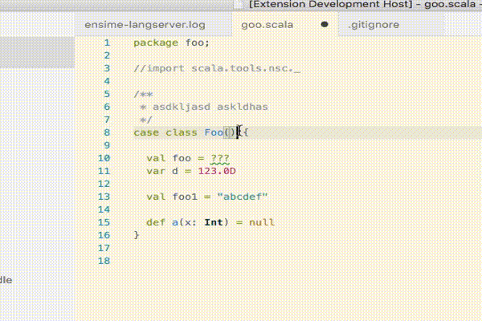

# Scala language server for VS Code

This is an experiment for building a Language Server for Scala, in Scala.

- language server: A Scala-based implementation of the [language server protocol](https://github.com/Microsoft/language-server-protocol/blob/master/protocol.md)
- scala: A Typescript-based Scala extension (language client). Ideally it will be ported to Scala.js
- ensime-server: An implementation of the Language Server based on Ensime

The language server may be backed up by [ensime](http://ensime.github.io/) or directly by the presentation compiler. Ideally, the language server ca be used as a basis for implementing support for any language, not just Scala.